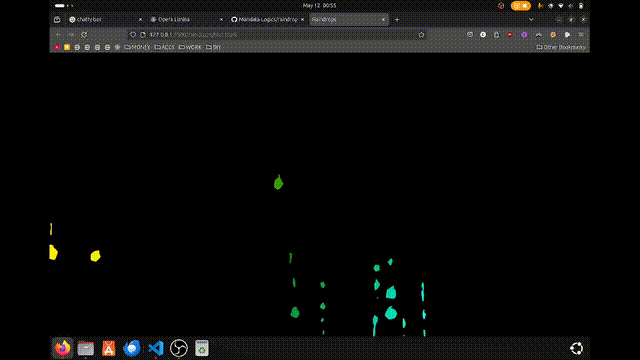

## Raindrop Canvas Effect

A simple physics engine built in JavaScript that simulates drops hitting a window and rolling down the glass.

The drop shapes are outputted as polygons and so they can be used any in number of ways, the demo page uses them to show off an animated background, done using css.

The behavior of the drops can be modified by changing gravity, surface tension, the amount of trails etc. etc.

## 📜 License

This project is licensed under CC BY-NC 4.0
Free for personal use. Commercial use requires permission.

💸 [Buy me a coffee](https://buymeacoffee.com/operalimina)

📬 Contact: [website@operalimina.com](mailto:website@operalimina.com)

[operalimina.co.uk](operalimina.co.uk)
